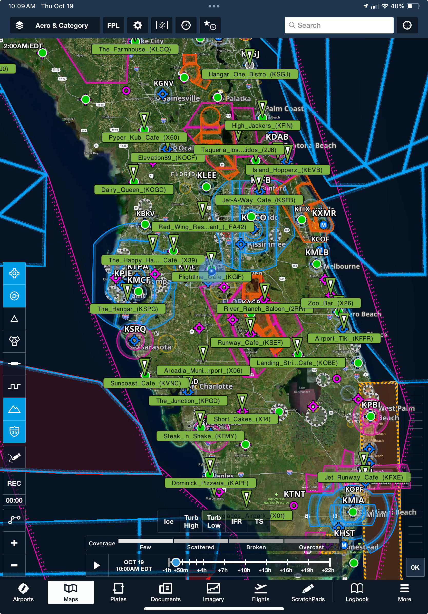

# Airport Restaurants

This repository is for pilot's who love a mission to fly and eat somewhere that is on location
of an airport or just nearby walking distance.  

Many pilot's use ForeFlight as their electronic flight bag (EFB) [ForeFlight](https://www.foreflight.com/) app,
which contains a feature to download and import custom *content packs* that contain  bundles of related 
content that can be accessed in the app, making it easier to adapt ForeFlight to a variety of specialized uses.
See [ForeFlight Content Pack Overview](https://www.foreflight.com/products/foreflight-mobile/user-content/content-packs) and [ForeFlight Content Pack Support](https://foreflight.com/support/content-packs/) 
for more details.

# Airport Restaurant's Content

This respository maintains a directory of airport restaurants viewable as waypoints on the ForeFlight map page by using the ForeFlight *content packs*.  This allows you to research and plan your destination around food.

As an example, this is how the restaurants are shown over Florida, once
the content pack is imported and selected from maps. 

  

## Inspiration and Credits

This work was inspired by others:

* [$100 Fly In Restaurants U.S. Facebook Group](https://www.facebook.com/groups/835536180175591) specifically Tad Smith's "Master List" and Shannon Harris work of converting this to a map.
* [Airport Based Restaurants Facebook Group](https://www.facebook.com/groups/724017862273138)
* [Airport Based Restaurants on Google Maps](https://www.google.com/maps/d/embed?mid=1ESeubCk9sDWafBt8iQ4dzXu97tftJBQ&hl=en&ehbc=2E312F&fbclid=IwAR0pxghD-9-qjVp166ebeCYMnEOpqAXOfqoKARUX1Tr5rWK2F8bplGpDelg&ll=48.50138401582604%2C-109.82212150000001&z=4)
* [AJ Poirier's Flying Home's Airport Restaurants across the US Google Map](https://www.google.com/maps/d/embed?mid=1ESeubCk9sDWafBt8iQ4dzXu97tftJBQ&hl=en&ehbc=2E312F&fbclid=IwAR0pxghD-9-qjVp166ebeCYMnEOpqAXOfqoKARUX1Tr5rWK2F8bplGpDelg&ll=48.50138401582604%2C-109.82212150000001&z=4) for the inital idea data used
  
## Importing Airport Restaurant's Content Packs into ForeFlight for Use 

Detailed instructions about how to import Content Packs into
Foreflight are available at their [support
page](https://www.foreflight.com/support/content-packs/) 

*Please note that these content packs are only updated when a new version is created. You must also update your 
local copy of ForeFlight content packs by re-downloading and re-importing into ForeFlight.   We hope that ForeFlight
will add additional features to allow for automatic updates of content packs.*

### North America - United States - Region ###

Current version **2023.10.20**

Download each content pack by state for ForeFlight:

<a href="https://ingramleedy.github.io/Airport_Restaurants/contentpacks/US-AK.zip">US-AK</a> | <a href="https://ingramleedy.github.io/Airport_Restaurants/contentpacks/US-AL.zip">US-AL</a> | <a href="https://ingramleedy.github.io/Airport_Restaurants/contentpacks/US-AR.zip">US-AR</a> | <a href="https://ingramleedy.github.io/Airport_Restaurants/contentpacks/US-AZ.zip">US-AZ</a> | <a href="https://ingramleedy.github.io/Airport_Restaurants/contentpacks/US-CA.zip">US-CA</a> | <a href="https://ingramleedy.github.io/Airport_Restaurants/contentpacks/US-CO.zip">US-CO</a> | <a href="https://ingramleedy.github.io/Airport_Restaurants/contentpacks/US-CT.zip">US-CT</a> | <a href="https://ingramleedy.github.io/Airport_Restaurants/contentpacks/US-DC.zip">US-DC</a> | <a href="https://ingramleedy.github.io/Airport_Restaurants/contentpacks/US-DE.zip">US-DE</a> | <a href="https://ingramleedy.github.io/Airport_Restaurants/contentpacks/US-FL.zip">US-FL</a> | <a href="https://ingramleedy.github.io/Airport_Restaurants/contentpacks/US-GA.zip">US-GA</a> | <a href="https://ingramleedy.github.io/Airport_Restaurants/contentpacks/US-HI.zip">US-HI</a> | <a href="https://ingramleedy.github.io/Airport_Restaurants/contentpacks/US-IA.zip">US-IA</a> | <a href="https://ingramleedy.github.io/Airport_Restaurants/contentpacks/US-ID.zip">US-ID</a> | <a href="https://ingramleedy.github.io/Airport_Restaurants/contentpacks/US-IL.zip">US-IL</a> | <a href="https://ingramleedy.github.io/Airport_Restaurants/contentpacks/US-IN.zip">US-IN</a> | <a href="https://ingramleedy.github.io/Airport_Restaurants/contentpacks/US-KS.zip">US-KS</a> | <a href="https://ingramleedy.github.io/Airport_Restaurants/contentpacks/US-KY.zip">US-KY</a> | <a href="https://ingramleedy.github.io/Airport_Restaurants/contentpacks/US-LA.zip">US-LA</a> | <a href="https://ingramleedy.github.io/Airport_Restaurants/contentpacks/US-MA.zip">US-MA</a> | <a href="https://ingramleedy.github.io/Airport_Restaurants/contentpacks/US-MD.zip">US-MD</a> | <a href="https://ingramleedy.github.io/Airport_Restaurants/contentpacks/US-ME.zip">US-ME</a> | <a href="https://ingramleedy.github.io/Airport_Restaurants/contentpacks/US-MI.zip">US-MI</a> | <a href="https://ingramleedy.github.io/Airport_Restaurants/contentpacks/US-MN.zip">US-MN</a> | <a href="https://ingramleedy.github.io/Airport_Restaurants/contentpacks/US-MO.zip">US-MO</a> | <a href="https://ingramleedy.github.io/Airport_Restaurants/contentpacks/US-MS.zip">US-MS</a> | <a href="https://ingramleedy.github.io/Airport_Restaurants/contentpacks/US-MT.zip">US-MT</a> | <a href="https://ingramleedy.github.io/Airport_Restaurants/contentpacks/US-NC.zip">US-NC</a> | <a href="https://ingramleedy.github.io/Airport_Restaurants/contentpacks/US-ND.zip">US-ND</a> | <a href="https://ingramleedy.github.io/Airport_Restaurants/contentpacks/US-NE.zip">US-NE</a> | <a href="https://ingramleedy.github.io/Airport_Restaurants/contentpacks/US-NH.zip">US-NH</a> | <a href="https://ingramleedy.github.io/Airport_Restaurants/contentpacks/US-NJ.zip">US-NJ</a> | <a href="https://ingramleedy.github.io/Airport_Restaurants/contentpacks/US-NM.zip">US-NM</a> | <a href="https://ingramleedy.github.io/Airport_Restaurants/contentpacks/US-NV.zip">US-NV</a> | <a href="https://ingramleedy.github.io/Airport_Restaurants/contentpacks/US-NY.zip">US-NY</a> | <a href="https://ingramleedy.github.io/Airport_Restaurants/contentpacks/US-OH.zip">US-OH</a> | <a href="https://ingramleedy.github.io/Airport_Restaurants/contentpacks/US-OK.zip">US-OK</a> | <a href="https://ingramleedy.github.io/Airport_Restaurants/contentpacks/US-OR.zip">US-OR</a> | <a href="https://ingramleedy.github.io/Airport_Restaurants/contentpacks/US-PA.zip">US-PA</a> | <a href="https://ingramleedy.github.io/Airport_Restaurants/contentpacks/US-RI.zip">US-RI</a> | <a href="https://ingramleedy.github.io/Airport_Restaurants/contentpacks/US-SC.zip">US-SC</a> | <a href="https://ingramleedy.github.io/Airport_Restaurants/contentpacks/US-SD.zip">US-SD</a> | <a href="https://ingramleedy.github.io/Airport_Restaurants/contentpacks/US-TN.zip">US-TN</a> | <a href="https://ingramleedy.github.io/Airport_Restaurants/contentpacks/US-TX.zip">US-TX</a> | <a href="https://ingramleedy.github.io/Airport_Restaurants/contentpacks/US-UT.zip">US-UT</a> | <a href="https://ingramleedy.github.io/Airport_Restaurants/contentpacks/US-VA.zip">US-VA</a> | <a href="https://ingramleedy.github.io/Airport_Restaurants/contentpacks/US-VT.zip">US-VT</a> | <a href="https://ingramleedy.github.io/Airport_Restaurants/contentpacks/US-WA.zip">US-WA</a> | <a href="https://ingramleedy.github.io/Airport_Restaurants/contentpacks/US-WI.zip">US-WI</a> | <a href="https://ingramleedy.github.io/Airport_Restaurants/contentpacks/US-WV.zip">US-WV</a> | <a href="https://ingramleedy.github.io/Airport_Restaurants/contentpacks/US-WY.zip">US-WY</a> 

### North America - Canada - Region ###

Current version **2023.10.21**

Download each content pack by state for ForeFlight:

<a href="https://ingramleedy.github.io/Airport_Restaurants/contentpacks/CA-AB.zip">CA-AB</a> | <a href="https://ingramleedy.github.io/Airport_Restaurants/contentpacks/CA-BC.zip">CA-BC</a> | <a href="https://ingramleedy.github.io/Airport_Restaurants/contentpacks/CA-MB.zip">CA-MB</a>
<a href="https://ingramleedy.github.io/Airport_Restaurants/contentpacks/CA-NB.zip">CA-NB</a> | <a href="https://ingramleedy.github.io/Airport_Restaurants/contentpacks/CA-NL.zip">CA-NL</a> | <a href="https://ingramleedy.github.io/Airport_Restaurants/contentpacks/CA-NS.zip">CA-NS</a> | <a href="https://ingramleedy.github.io/Airport_Restaurants/contentpacks/CA-NT.zip">CA-NT</a> | <a href="https://ingramleedy.github.io/Airport_Restaurants/contentpacks/CA-NU.zip">CA-NU</a> | <a href="https://ingramleedy.github.io/Airport_Restaurants/contentpacks/CA-ON.zip">CA-ON</a> | <a href="https://ingramleedy.github.io/Airport_Restaurants/contentpacks/CA-PE.zip">CA-PE</a> | <a href="https://ingramleedy.github.io/Airport_Restaurants/contentpacks/CA-QC.zip">CA-QC</a> | <a href="https://ingramleedy.github.io/Airport_Restaurants/contentpacks/CA-SK.zip">CA-SK</a> | <a href="https://ingramleedy.github.io/Airport_Restaurants/contentpacks/CA-YT.zip">CA-YT</a> |

### North America - Bahamas - Region ###

Current version **2023.10.21**

Download each content pack by state for ForeFlight:

<a href="https://ingramleedy.github.io/Airport_Restaurants/contentpacks/BS-AK.zip">BS-AK</a> | <a href="https://ingramleedy.github.io/Airport_Restaurants/contentpacks/BS-BI.zip">BS-BI</a> | <a href="https://ingramleedy.github.io/Airport_Restaurants/contentpacks/BS-BY.zip">BS-BY</a>
<a href="https://ingramleedy.github.io/Airport_Restaurants/contentpacks/BS-CE.zip">BS-CE</a> | <a href="https://ingramleedy.github.io/Airport_Restaurants/contentpacks/BS-CI.zip">BS-CI</a> | <a href="https://ingramleedy.github.io/Airport_Restaurants/contentpacks/BS-CK.zip">BS-CK</a> | <a href="https://ingramleedy.github.io/Airport_Restaurants/contentpacks/BS-CO.zip">BS-CO</a> | <a href="https://ingramleedy.github.io/Airport_Restaurants/contentpacks/BS-EG.zip">BS-EG</a> | <a href="https://ingramleedy.github.io/Airport_Restaurants/contentpacks/BS-EX.zip">BS-EX</a> | <a href="https://ingramleedy.github.io/Airport_Restaurants/contentpacks/BS-FP.zip">BS-FP</a> | <a href="https://ingramleedy.github.io/Airport_Restaurants/contentpacks/BS-HI.zip">BS-HI</a> | <a href="https://ingramleedy.github.io/Airport_Restaurants/contentpacks/BS-IN.zip">BS-IN</a> | <a href="https://ingramleedy.github.io/Airport_Restaurants/contentpacks/BS-LI.zip">BS-LI</a> | <a href="https://ingramleedy.github.io/Airport_Restaurants/contentpacks/BS-MG.zip">BS-MG</a> | <a href="https://ingramleedy.github.io/Airport_Restaurants/contentpacks/BS-NO.zip">BS-NO</a> | <a href="https://ingramleedy.github.io/Airport_Restaurants/contentpacks/BS-NP.zip">BS-NP</a> | <a href="https://ingramleedy.github.io/Airport_Restaurants/contentpacks/BS-NS.zip">BS-NS</a> | <a href="https://ingramleedy.github.io/Airport_Restaurants/contentpacks/BS-RC.zip">BS-RC</a> | <a href="https://ingramleedy.github.io/Airport_Restaurants/contentpacks/BS-RI.zip">BS-RI</a> | <a href="https://ingramleedy.github.io/Airport_Restaurants/contentpacks/BS-SA.zip">BS-SA</a> | <a href="https://ingramleedy.github.io/Airport_Restaurants/contentpacks/BS-SE.zip">BS-SE</a> | <a href="https://ingramleedy.github.io/Airport_Restaurants/contentpacks/BS-SO.zip">BS-SO</a> | <a href="https://ingramleedy.github.io/Airport_Restaurants/contentpacks/BS-SS.zip">BS-SS</a> | <a href="https://ingramleedy.github.io/Airport_Restaurants/contentpacks/BS-WG.zip">BS-WG</a> |

### North America - Mexico - Region ###

Current version **2023.10.21**

Download each content pack by state for ForeFlight:
<a href="https://ingramleedy.github.io/Airport_Restaurants/contentpacks/MX-AGU.zip">MX-AGU</a> | <a href="https://ingramleedy.github.io/Airport_Restaurants/contentpacks/MX-BCN.zip">MX-BCN</a> | <a href="https://ingramleedy.github.io/Airport_Restaurants/contentpacks/MX-BCS.zip">MX-BCS</a>
<a href="https://ingramleedy.github.io/Airport_Restaurants/contentpacks/MX-CAM.zip">MX-CAM</a> | <a href="https://ingramleedy.github.io/Airport_Restaurants/contentpacks/MX-CHH.zip">MX-CHH</a> | <a href="https://ingramleedy.github.io/Airport_Restaurants/contentpacks/MX-CHP.zip">MX-CHP</a> | <a href="https://ingramleedy.github.io/Airport_Restaurants/contentpacks/MX-COA.zip">MX-COA</a> | <a href="https://ingramleedy.github.io/Airport_Restaurants/contentpacks/MX-COL.zip">MX-COL</a> | <a href="https://ingramleedy.github.io/Airport_Restaurants/contentpacks/MX-DIF.zip">MX-DIF</a> | <a href="https://ingramleedy.github.io/Airport_Restaurants/contentpacks/MX-DUR.zip">MX-DUR</a> | <a href="https://ingramleedy.github.io/Airport_Restaurants/contentpacks/MX-GRO.zip">MX-GRO</a> | <a href="https://ingramleedy.github.io/Airport_Restaurants/contentpacks/MX-GUA.zip">MX-GUA</a> | <a href="https://ingramleedy.github.io/Airport_Restaurants/contentpacks/MX-HID.zip">MX-HID</a> | <a href="https://ingramleedy.github.io/Airport_Restaurants/contentpacks/MX-JAL.zip">MX-JAL</a> | <a href="https://ingramleedy.github.io/Airport_Restaurants/contentpacks/MX-MEX.zip">MX-MEX</a> | <a href="https://ingramleedy.github.io/Airport_Restaurants/contentpacks/MX-MIC.zip">MX-MIC</a> | <a href="https://ingramleedy.github.io/Airport_Restaurants/contentpacks/MX-MOR.zip">MX-MOR</a> | <a href="https://ingramleedy.github.io/Airport_Restaurants/contentpacks/MX-NAY.zip">MX-NAY</a> | <a href="https://ingramleedy.github.io/Airport_Restaurants/contentpacks/MX-NLE.zip">MX-NLE</a> | <a href="https://ingramleedy.github.io/Airport_Restaurants/contentpacks/MX-OAX.zip">MX-OAX</a> | <a href="https://ingramleedy.github.io/Airport_Restaurants/contentpacks/MX-PUE.zip">MX-PUE</a> | <a href="https://ingramleedy.github.io/Airport_Restaurants/contentpacks/MX-QUE.zip">MX-QUE</a> | <a href="https://ingramleedy.github.io/Airport_Restaurants/contentpacks/MX-ROO.zip">MX-ROO</a> | <a href="https://ingramleedy.github.io/Airport_Restaurants/contentpacks/MX-SIN.zip">MX-SIN</a> | <a href="https://ingramleedy.github.io/Airport_Restaurants/contentpacks/MX-SLP.zip">MX-SLP</a> | <a href="https://ingramleedy.github.io/Airport_Restaurants/contentpacks/MX-SON.zip">MX-SON</a> | <a href="https://ingramleedy.github.io/Airport_Restaurants/contentpacks/MX-TAB.zip">MX-TAB</a> | <a href="https://ingramleedy.github.io/Airport_Restaurants/contentpacks/MX-TAM.zip">MX-TAM</a> | <a href="https://ingramleedy.github.io/Airport_Restaurants/contentpacks/MX-TLA.zip">MX-TLA</a> | <a href="https://ingramleedy.github.io/Airport_Restaurants/contentpacks/MX-VER.zip">MX-VER</a> | <a href="https://ingramleedy.github.io/Airport_Restaurants/contentpacks/MX-YUC.zip">MX-YUC</a> | <a href="https://ingramleedy.github.io/Airport_Restaurants/contentpacks/MX-ZAC.zip">MX-ZAC</a> |

## Version History and Future Ideas
* Version 2023.10.20 -
   * Complete re-work and sourced data from Google Maps of
all restaurants within a one mile (1-mile) radius of all airports in the US.
   * Added links to rich online data when a waypoint is selected.
   * Added breakout by US states.
   * Future feature add other countries, like Canada

* Version 1.0
   * Working concept.
   * Content Packs allow offline content to 
viewed in flight without Internet connectivity.  
   * A future version may add an additional offline *Profile* page with pictures, 
addresses, and links to Google Maps for pictures, reviews, and menus 
(for when you do have Internet connectivity).
   * Need automated way to create a
template profile page from the content will need to be written.
   * Need automated way to keep content up-to-date from the source(s) and to build the *content pack* automatically.
   * Need automated way to push the up-to-date *content pack* directly to ForeFlight. 

## ForeFlight Feature Request to Automatically Update New Versions

Keeping this *content packs* updated once imported into ForeFlight requires re-downloading
newer content packs and re-importing into ForeFlight.  

#### Feature Request ####
- The ability for content packs to be downloaded and updated from a URL. 

  - Another method is to add to your cloud storage for *Performance Plus* 
subscribers of ForeFlight, by adding a folder named 
*contentpacks* to the root folder and place your content packs in
the folder. This allows the content packs available to download and update
automatically from all your devices (assuming you update new *content packs*
in the shared folder).

- ForeFlight only allows one cloud provider to be in use at a time. This solution could be
improved to allow multiple cloud drive storage providers to be used concurrently.

  - Pilots may need access to multiple resources, companies, flight schools, 
flight clubs, 3rd party content, etc. I envision a subscription service that
provided valuable content on various contant that would currate and 
keep up-to-date.

Send your support for these request to ForeFlight Support [support@foreflight.com](mailto:support@foreflight.com).

## DataSets ##

* World arport data is provided GitHub repository [davidmegginson/ourairports-data](https://github.com/davidmegginson/ourairports-data).
* Location data is provided by [Google Maps API](https://developers.google.com/maps). 
 
# Legal Disclaimer

All files are provided for educational purposes only. They are not to
be used as a navigation tool. No claim is made regarding the accuracy
of these charts and their contents.

